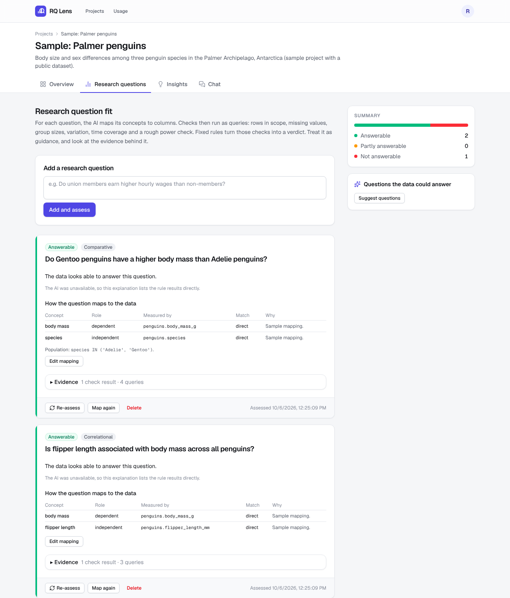
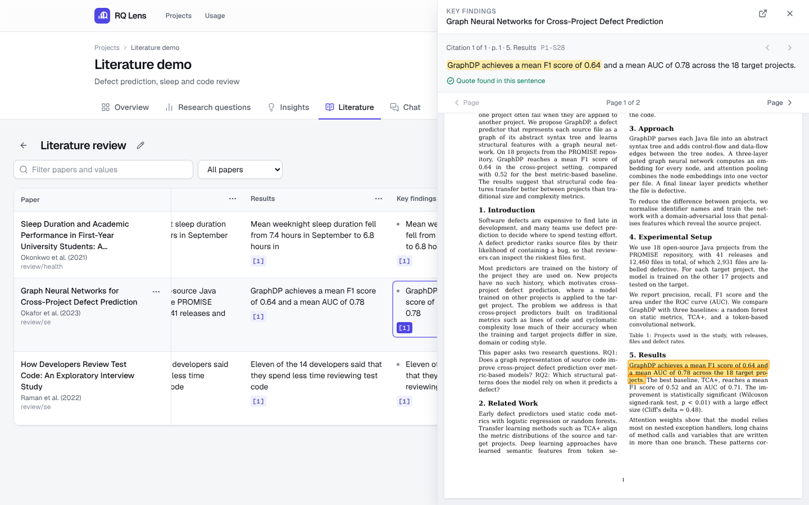

# RQ Lens

**Know what your data can answer before you design the study.**

RQ Lens is a companion for researchers working with a tabular dataset. Upload CSV files and write your research questions. RQ Lens profiles every column, tells you whether each question is answerable with this data and why, ranks exploratory findings, and answers questions in plain language. Every number on screen comes from a logged SQL query you can open and rerun.





## What it does

| Feature | How it works |
|---|---|
| **Profiling** | Pure SQL in DuckDB, with no AI involved. It finds types, missing values, distributions, outliers, correlations, missing-data patterns and join keys, plus rule-based warnings for placeholder codes such as `-999`, label leakage, unit changes and near-duplicate columns. |
| **Research-question fit** | An LLM parses each question and maps its constructs to columns. Guarded SQL checks then measure rows in scope, missing values, group sizes, outcome variation, time coverage and statistical power. **Fixed rules** give the verdict: answerable, partly answerable or not answerable. The LLM only writes the explanation, and every number in it must appear in a query result. |
| **Insights** | Up to 20 analyses are planned from your questions and the profile, then run with a fixed statistics library (Spearman, Mann-Whitney U, Kruskal-Wallis, chi-square, trend). Results are corrected with Benjamini-Hochberg, ranked by relevance, effect size and support (not p-value), and re-tested within subgroups to catch confounding. |
| **Chat** | A bounded tool-using agent (schema, profiles, column search, read-only SQL, statistical tests, charts). Answers stream back with their queries, and an answer with a number not found in any tool result is rejected. |
| **Literature review** | Upload PDFs or a whole folder. Each paper is split into numbered sentences with their positions on the page, and the AI fills a review table (built-in templates or your own), citing sentence IDs with quotes. A check without AI verifies every quote and number against the cited sentence; failures are retried once, then marked *unverified*. Click a citation to open the PDF at that page with the sentence highlighted. Edits are never overwritten; exports to CSV, Excel, Markdown and BibTeX. |
| **Dataset report** | A Markdown or PDF report with an overview, data dictionary, quality warnings, question fit, top insights and limitations. It works as a draft of a paper's data section. |
| **Usage and limits** | Every AI call and query is logged. The Usage page shows calls, tokens, cost and latency (average and p95) per project. Per-user limits cover projects, datasets, upload size and monthly AI calls and spend. |

To try it without your own data, click **Try a sample project**. This loads the Palmer penguins data with three research questions, and works without an AI key.

## Architecture

```
Browser ── Next.js 16 (App Router, Auth.js) ──── signed 5-minute JWT ───┐
                                                                         ▼
             Redis ◀── enqueue ── FastAPI ──▶ Postgres (projects, profiles, RQs,
               │                     │          insights, chats, llm_calls, queries)
               ▼                     │
           arq worker                └──▶ DuckDB, one file per project,
  ingest → profile → describe                opened read-only by the SQL guard
  assess RQs · generate insights
               │
               └──▶ LLM (any OpenAI-compatible API; Gemini by default)
```

Design rules:

1. **The data stays in DuckDB.** The LLM sees the schema, profile statistics, a few masked sample values and query results, never the raw table. Personal data (emails, phone numbers, IP addresses) is detected and masked before any AI call.
2. **Generated SQL is guarded.** sqlglot allows one `SELECT` over the project's own tables. DuckDB runs read-only, with external access off, a memory limit and a 30-second timeout.
3. **Decisions are deterministic, words are generated.** Verdicts come from rules in `apps/api/rq/verdict.py` and statistics from `apps/api/stats/`. The LLM explains and rewords, and its text is checked against the numbers it was given. If the model fails, rule-based text is used, so a result is never lost.
4. **Everything is traced.** Each AI call (prompt version, tokens, cost, latency, errors) goes to `llm_calls`, and each query to `queries`, linked to the answer, verdict or insight it supports.

| Path | Contents |
|---|---|
| `apps/api/` | FastAPI app, arq worker, profiler, SQL guard, agent, RQ and insight pipelines, report builder |
| `apps/api/prompts/` | Versioned prompts (`rq_parse.v1.md` and others); the version is stored with each call |
| `apps/web/` | Next.js front end |
| `evals/` | Benchmarks, versioned datasets and the eval runner ([evals/README.md](evals/README.md)) |
| `tests/` | Unit and pipeline tests (pytest) |
| [`plan.md`](plan.md), [`PROGRESS.md`](PROGRESS.md), [`DECISIONS.md`](DECISIONS.md) | The plan, its status, and the reasoning behind the verdict and ranking rules |

## Run it locally

You need Docker, Node 24 with pnpm, and Python 3.12.

```sh
cp .env.example .env          # set AUTH_SECRET, API_JWT_SECRET, a sign-in provider, LLM_API_KEY
docker compose up -d          # Postgres, Redis, API (port 8000, runs migrations) and worker
cd apps/web && pnpm install && pnpm dev   # http://localhost:3000
```

Checks run in CI:

```sh
python -m venv .venv && .venv/bin/pip install -e ".[dev]"
.venv/bin/ruff check . && .venv/bin/ruff format --check . && .venv/bin/mypy && .venv/bin/pytest
cd apps/web && pnpm lint && pnpm typecheck && pnpm format:check
```

To deploy, see [DEPLOY.md](DEPLOY.md). It covers the production Compose file, health checks, error tracking and backups.

## Evaluation

```sh
PYTHONPATH=apps:. python evals/run_eval.py qa         # chat accuracy (execution match against gold SQL)
PYTHONPATH=apps:. python evals/run_eval.py qa --smoke # 15-question smoke set
PYTHONPATH=apps:. python evals/run_eval.py rq         # RQ verdict agreement and mapping precision/recall
PYTHONPATH=apps:. python evals/run_eval.py insights   # insight generation across all datasets
PYTHONPATH=apps:. python evals/run_eval.py lit        # literature extraction with citations
```

There are 9 versioned development datasets: survey, software defects, time series, timestamps, a 75-column table, leakage and missingness cases, and a deliberately messy export.

### Results so far

| Benchmark | Result | Caveat |
|---|---|---|
| RQ verdicts with labelled mappings | 13 of 13 cases agree (4 of them unanswerable) | Development set. One rule was added after a disagreement, so this is not an unbiased accuracy. |
| Insights on all 9 datasets | 161 insights, all charted; **0** with a number that cannot be traced to a query | Template wording; the LLM rewording has not been run with a real model |
| Planted effects | A planted strong effect ranks first; 6 pure-noise pairs come out as "no clear evidence" after correction; a planted Simpson's paradox is caught | Unit tests |
| Chat accuracy (31 questions) | Harness passes 31 of 31 with a scripted model | **No real-model run yet.** The gold answers have not been checked by hand. |
| Literature extraction (benchmark D, 5 papers, 65 labelled cells) | Oracle self-test 100% on accuracy, citation precision and recall, and not-found accuracy, including both planted cases | Synthetic papers; **no real-model run yet**. Real papers still need collecting and labelling. |
| Tests | 264 unit and pipeline tests | |

The real-model benchmarks (chat accuracy on 120 to 150 questions, planted-issue detection, verdict agreement on 60 hand-labelled pairs) are Phase 5 in [plan.md](plan.md). They need an API key with enough quota and hand-checked labels.

## Limitations

- **Observational data only.** RQ Lens flags causal wording and suggests confounders, but it cannot make an association causal.
- **One table per question.** Feasibility checks and insights work within one table; multi-table questions need a combined dataset first (the Combine feature).
- **Placeholder codes are flagged, not replaced.** Values such as `-999` cannot be told apart from real values without a data dictionary. Upload one to resolve them. A real category spelled `None` is also treated as missing.
- **Candidate keys are single columns.** Composite keys are not detected.
- **CSV only.** No Excel, SPSS, Stata or Parquet upload yet.
- **The AI steps depend on the model.** Parsing questions, mapping them to columns, and chat quality vary with the model, and have not yet been benchmarked against a real model.
- **No collaboration.** Each project belongs to one user.
- **Papers need a text layer.** Scanned PDFs are detected but not OCR'd. Equations are skipped, and tables are cited by their caption.
- **Paper metadata is heuristic.** Title and authors come from the first page's layout; correct them when the parser gets them wrong (they are editable).
